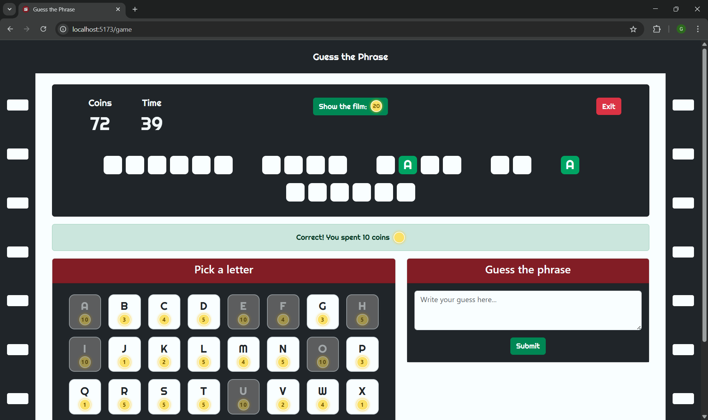

# Exam #3: "Indovina la Frase"
## Student: s349387 MONDINO GABRIELE 

## React Client Application Routes

- **Route `/`** - ***Home page***: permette di avviare una nuova partita (modalità demo o autenticata) e di accedere al login/logout.
- **Route `/login`** - ***Login page***: form di autenticazione utente.
- **Route `/game`** - ***Game page***: mostra la griglia della frase da indovinare, il timer, la tastiera per scegliere le lettere, l’area per inserire la frase, il saldo delle monete e tutte le azioni di gioco.
- **Route `*`** - ***Not Found***: pagina di errore per route non esistenti.

## API Server

- **POST `/api/sessions`**  
  - Login utente.
- **DELETE `/api/sessions/current`**  
  - Logout utente.
- **GET `/api/sessions/current`**  
  - **Risposta:** dati utente autenticato (se presente).
- **GET `/api/user/coins`**  
  - **Risposta:** saldo monete utente.
- **POST `/api/game`**  
  - Crea una nuova partita
  - **Risposta:** id partita creata.
- **GET `/api/game/:id`**  
  - **Risposta:** stato partita (frase mascherata, lettere usate, ecc.).
- **PATCH `/api/game/:id/guessLetter`**  
  - Gestisce il tentativo di indovinare una lettera, verificando la correttezza della lettera e aggiornando la partita
  - **Body:** `{ letter }`  
  - **Risposta:** esito tentativo, variazione di monete, bilancio totale monete.
- **PATCH `/api/game/:id/guessPhrase`**
  - Gestisce il tentativo di indovinare la frase, verificando la correttezza della frase e aggiornando la partita
  - **Body:** `{ phrase }`  
  - **Risposta:** esito tentativo, variazione di monete, bilancio totale monete.
- **PATCH `/api/game/:id/expiredTime`**  
  - Gestisce la scadenza del tempo di gioco e aggiorna la partita
  - **Risposta:** variazione di monete, bilancio totale monete.
- **PATCH `/api/game/:id/showFilm`**  
  - Gestisce la richiesta di visualizzare il nome del film e aggiorna la partita  
  - **Risposta:** variazione di monete, bilancio totale monete.
- **DELETE `/api/game/:id`**  
  - Elimina la partita.

## Database Tables

- **Table `Users`**  
  - `username` (chiave)
  - `password`: password hashed
  - `salt`
  - `email`
  - `coins`
- **Table `Phrases`**  
  - `id` (chiave)
  - `text`
  - `film`
  - `logged`: 0=demo, 1=autenticato
- **Table `Games`**  
  - `id` (chiave)
  - `phraseId`
  - `username`: vale null nella versione demo
  - `revealed`: maschera della frase, dove le lettere non ancora scoperte sono sostituite con _
  - `vowelUsed`: 0=non è stata ancora usata una vocale, 1=vocale già usata
  - `usedLetters`: lettere già utilizzate (sia sbagliate che corrette)
  - `showFilm`: 0=non mostrare il titolo del film all'utente, 1=mostralo
  - `gameCoins`: bilancio delle monete guadagnate e perse nella partita. Vale sempre 0 nella versione demo.
  - `ended`: 0=partita non finita, 1=partita terminata
  - `win`: 0=partita non vinta, 1=partita vinta
  - `startTime`: timestamp inizio partita, usato per il timer
- **Table `Letters`**  
  - `letter` (chiave)
  - `cost`

## Main React Components

- **`Layout`** (in `Layout.jsx`): struttura comune (navbar, footer, bande laterali con motivo a pellicola).
- **`NavbarCustom`** (in `Navbar.jsx`): navbar con l'icona del gioco, che riporta alla home. Se premuta durante il gioco, funziona come tasto di uscita.
- **`HomePage`** (in `Home.jsx`): schermata iniziale con pulsanti per avviare una partita e per login/logout.
- **`GamePage`** (in `Game.jsx`): logica e UI della partita.
- **`GameStatusBar`** (in `Game.jsx`): mostra monete, tempo, il pulsante exit, il pulsante per visualizzare il titolo del film e, una volta premuto quest'ultimo, il titolo del film stesso.
- **`PhraseViewer`** (in `Game.jsx`): griglia che visualizza la frase mascherata e le lettere indovinate.
- **`LetterSelector`** (in `Game.jsx`): tastiera dove si selezionano le lettere. Visualizza i rispettivi costi e gestisce i click, le disattivazioni e i tooltip che spiegano perché una lettera non può più essere scelta.
- **`GuessPhraseBox`** (in `Game.jsx`): area per inserire e inviare la frase completa.
- **`EndGameModal`** (in `Game.jsx`): modale di riepilogo a fine partita.
- **`Timer`** (in `Game.jsx`): timer della partita
- **`LoginPage` e `AuthForm`** (in `Login.jsx`): form di login.
- **`NotFound`** (in `NotFound.jsx`): pagina per route non esistenti.
- **`Footer`** (in `Footer.jsx`): footer con informazioni sull'autore.

## Screenshot

## Users Credentials

- **gabrimondo / Gabbo05012002**: utente con partite e con monete
- **prof1234 / Ciao1234**: utente senza partite
- **iacopom / 27Ottobre**: utente con partite e senza monete
